# Instagram Crawler — Flow Chart

> Gunakan VSCode extension **Markdown Preview Mermaid** atau [Mermaid Live Editor](https://mermaid.live) untuk melihat diagram.

---

## 1. CLI Entry Point & Dispatch

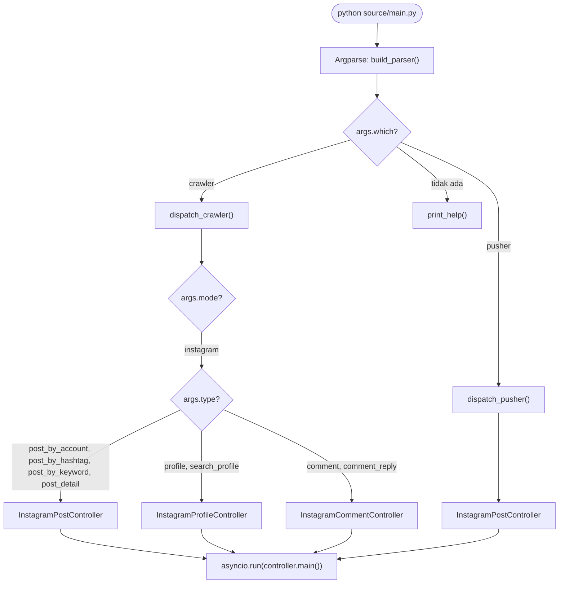

---

## 2. Controller Initialization (Base Constructor)

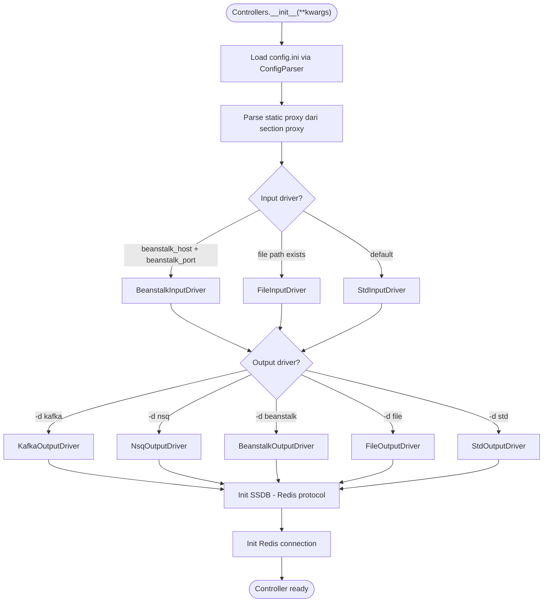

---

## 3. Main Loop

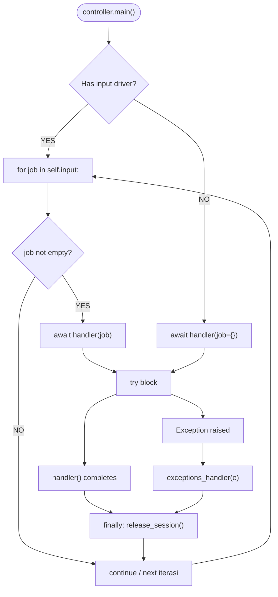

---

## 4. Authentication & Session Lifecycle

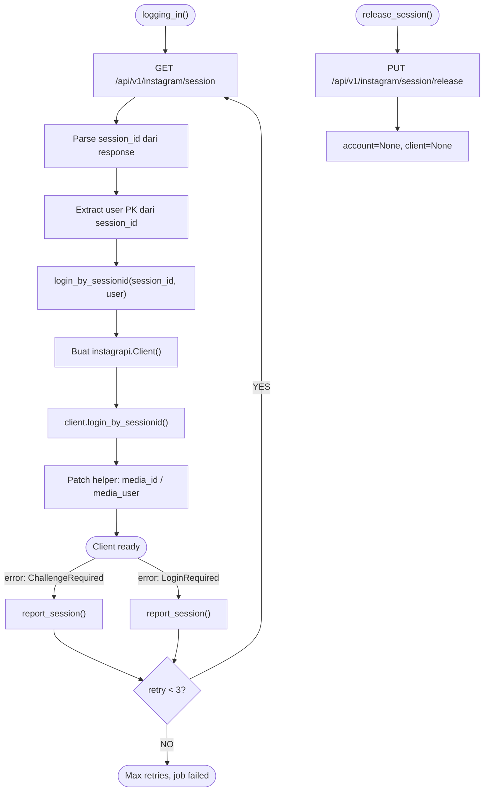

---

## 5. Post Crawling Flow

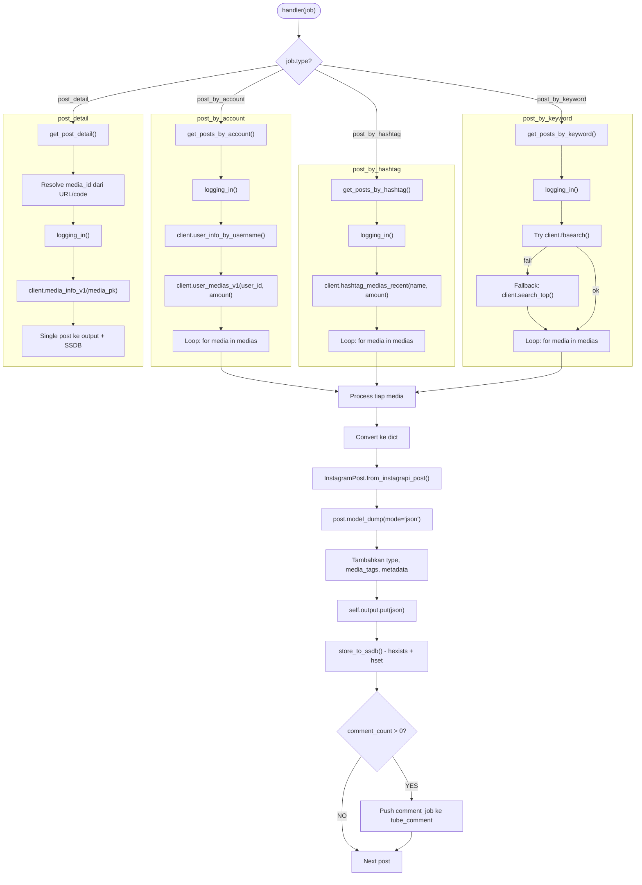

---

## 6. Comment Crawling Flow

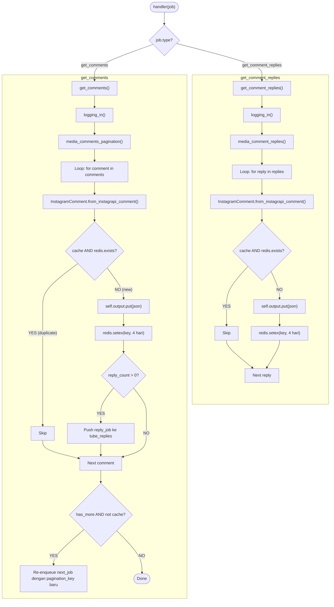

---

## 7. Profile Crawling Flow

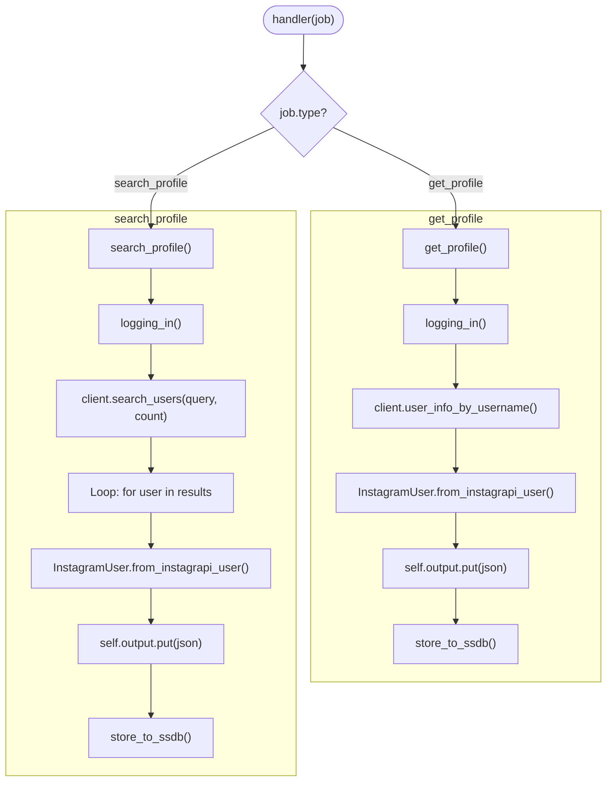

---

## 8. Exception Handling Flow

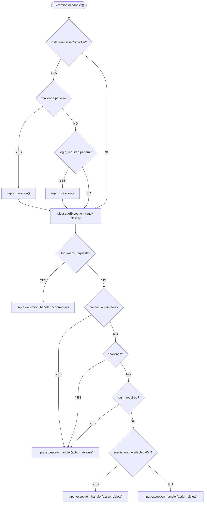

---

## 9. Job Chaining Overview

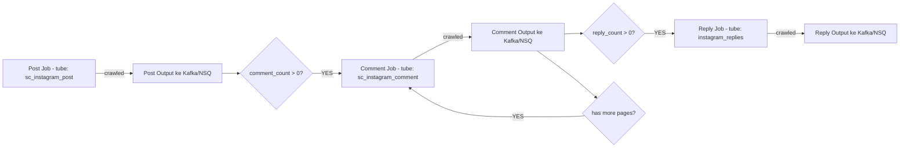

---

## 10. Overall System Architecture

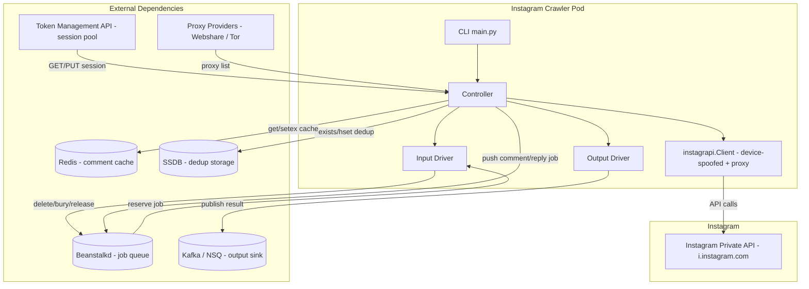

---

## 11. Data Model Mapping

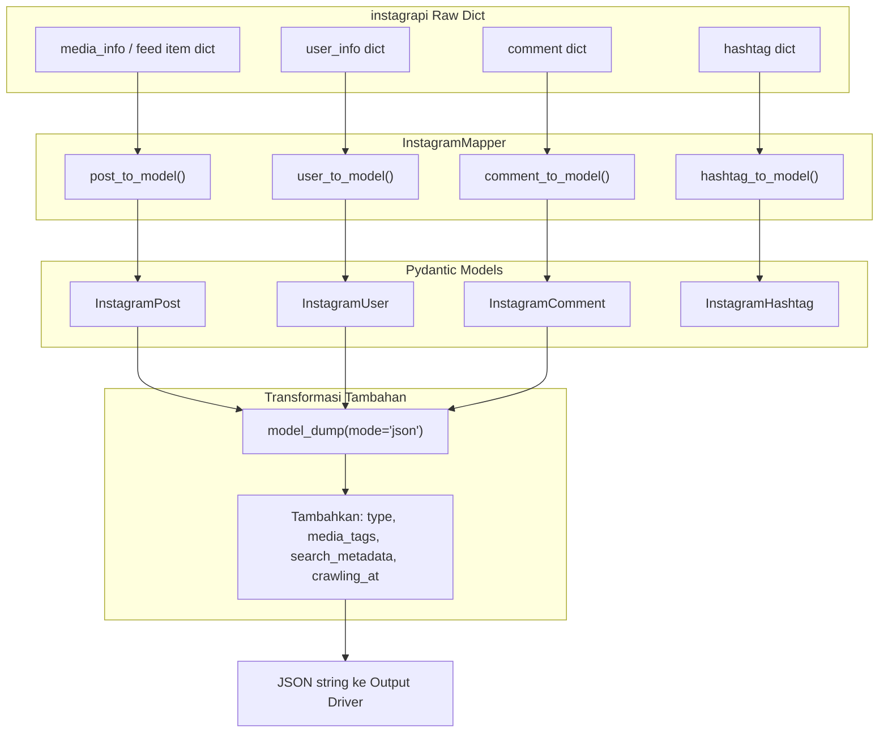

---

> **Catatan perbedaan README vs kode aktual:**
> - README: config via `.env` → **Kode: `config.ini` via ConfigParser**
> - Beanstalk: pakai library `greenstalk`
> - SSDB: diakses via `redis.StrictRedis` (Redis-protocol compatible)
> - HTML parser (`HtmlParser`) ada tapi tidak dipakai controller Instagram
